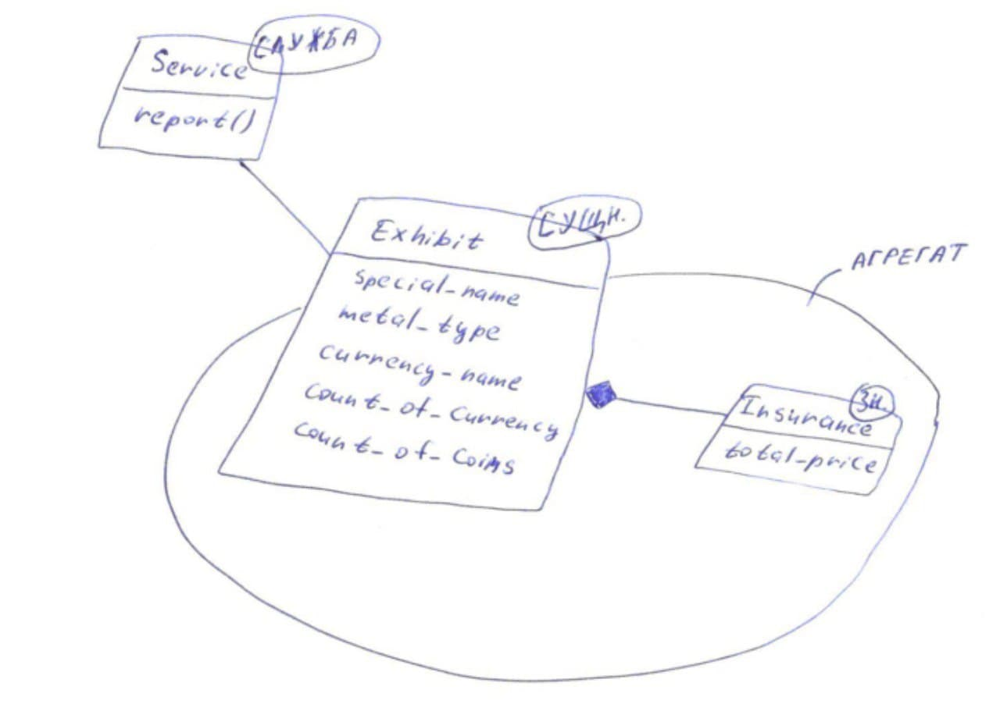

Министерство науки и высшего образования Российской Федерации  
Федеральное государственное бюджетное образовательное учреждение  
высшего образования  
«Московский государственный технический университет  
имени Н.Э. Баумана  
(национальный исследовательский университет)»  
(МГТУ им. Н.Э. Баумана)

ФАКУЛЬТЕТ ИНФОРМАТИКА И СИСТЕМЫ УПРАВЛЕНИЯ  
КАФЕДРА КОМПЬЮТЕРНЫЕ СИСТЕМЫ И СЕТИ (ИУ6)

 

ОТЧЕТ  
к лабораторной работе №4  
по дисциплине "Современные средства разработки  
программного обеспечения"  
Рефакторинг. Выделение сущностей, значений и служб модели.

 

Преподаватель: Фетисов М.В.

Студент группы ИУ6-54Б Каташинский Кирилл Юрьевич.

## Описание задания

Задача №10: "Коллекция монет".

Произошло ограбление музея с редкими монетами. Страховой компании необходимо составить отчёт по страховой выплате музею, если известно, что часть экспозиции сохранилась, а условная стоимость экспонатов зафиксирована в специальной таблице.

## Адрес проекта

Проект хранится в репозитории по адресу: [https://bmstu.codes/lsx/mstd/iu6-5-2021/iu6-54b-kykatashinskiy/l4](https://bmstu.codes/lsx/mstd/iu6-5-2021/iu6-54b-kykatashinskiy/l4).

Описание классов хранится в репозитории по адресу: [http://lsx.pages.bmstu.codes/mstd/iu6-5-2021/iu6-54b-kykatashinskiy/l4/](http://lsx.pages.bmstu.codes/mstd/iu6-5-2021/iu6-54b-kykatashinskiy/l4/).

## Диаграмма классов агрегата Exhibit

Диаграмма классов агрегата Exhibit:

## Выводы

В ходе данной лабораторной работы был произведен рефакторинг исходной программы и были выделены сущности, значения, службы и агрегаты в ней.
